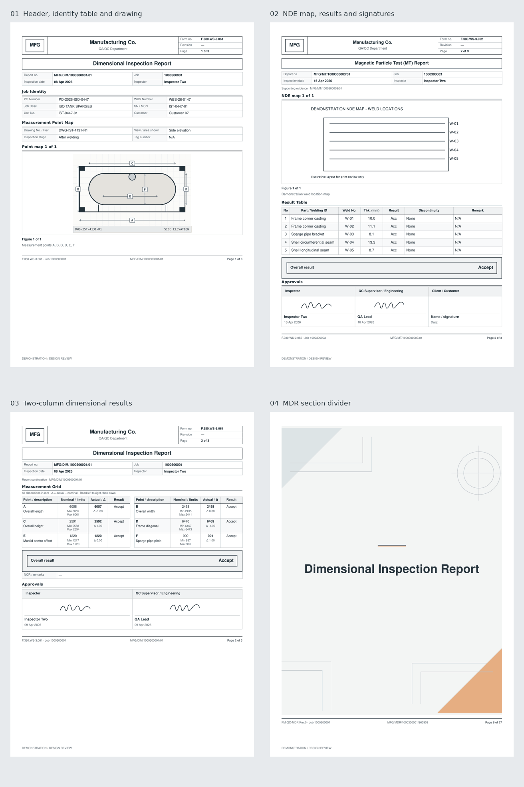

# Industrial PDF layout

All ten report templates and the Manufacturing Data Record (MDR) use compact controlled forms. Inspection reports follow the inspection sequence: details, supporting map or drawing, results, overall decision and signatures. White paper, graphite text and fine rules keep the information readable.



## Page and typography

| Element | Specification |
| --- | --- |
| Paper | A4 portrait, 210 × 297 mm |
| Margins | 12 mm top, 10 mm sides, 14 mm bottom |
| Body | Arial / Helvetica; 8.5 pt detail values and 9 pt general text |
| Header | Logo, company name, and three form-control lines: form number, revision, page |
| Document title | Centered 13 pt bordered band, separated from the header by 3 mm |
| Identity table | Report number / job; inspection date / inspector; two bordered label/value pairs per row |
| Table headings | 8 pt, pale gray fill, fine graphite rules |
| Field labels | 7.5 pt beside the value |
| Footer | 7 pt, report identity and Page x of y |
| Signature area | 13 mm of ink space, followed by name and date |
| Inline map | 72 mm image frame; contain without cropping |
| Signed-record evidence | 180 mm image frame; contain without cropping |

The identity table omits lifecycle status. Returned and voided records retain their existing watermark. Form revision comes from `report.formRevision` or `schema.revision`; an unconfigured revision is a dash and revision zero is retained. The revision of an attached ITP/PTR/IRN remains separate from the form revision.

## Content and pagination

`src/lib/printLayout.js` builds the page plan used by rendering and page counts. Supporting equipment, lighting and technique details retain schema order, followed by the NDE map or dimensional drawing, the results and the concise overall decision. Multiple maps are retained at their schema position before results. Ordinary photographs follow the report, paired where possible; filed signed records retain individual evidence pages. Hydrotest charts remain attached.

The narrative “Statement of result” and MDR “Statement of Inspection” are removed, together with the obsolete MDR statement-selection option. The short **Overall result** remains after the measurements, followed by any recorded result notes and signatures. An empty or unjudged result grid displays **Not recorded**, rather than an inferred acceptance. Existing recorded signature images are printed; an absent image leaves wet-signature space.

Detail fields use compact label/value pairs and full-width long notes. Short sections stay together; long values continue without truncation. Table headings repeat and row numbering continues. Short result tables reserve room for the overall decision and signatures where possible. Long tables continue with useful groups of rows. The print fitter can reduce content to 90% before requesting additional pages.

Dimensional results use two groups of four columns, read left to right and then down. Every point retains its description, nominal value, minimum, maximum, actual measurement, deviation, judgement and notes. An odd final point leaves the opposite half empty. Hydrotest tables retain a wider remarks column for long observations.

## MDR section dividers

The MDR includes a cover, a divider and contents, a divider and inspection register, a divider and disposition/approvals, then a divider before every bound report. Each divider is a single A4 page with a centered section title, pale blue-gray background, muted technical line graphics and a small warm-orange accent. Native SVG keeps the graphics sharp. Its footer retains the MDR identity and page number.

The contents references each section's divider page and explains that its document starts on the next page. The inspection register references the actual first report page. All divider, continuation and evidence pages count toward the total. The latest main branch's incomplete-MDR warning remains: its cover names outstanding deliverables and every page, including dividers, carries PREVIEW. PDI report titles remain consistent between divider, contents, register and report.

Stored reports, approval actions and domain acceptance calculations retain their existing behavior. The hydrotest chart note describes the recorded pressure trend and refers to the acceptance decision rather than inferring absence of leakage from pressure alone.

## Verification

- `npm run check` passed with 200 tests across 16 files, zero lint errors (83 warnings), a successful production build and passing bundle budgets. Two additional MDR integration cases then passed in the 34-test print-layout suite, bringing verified coverage to **202 tests**. JavaScript: 183.5 KB gzip / 200 KB budget; CSS: 42.7 KB gzip / 45 KB budget.
- Fourteen offline PDF samples cover all ten templates, an MDR, 60 result rows with long notes and five photos, 41 dimensional points with rejection notes, and 20 hydrotest checkpoints with long remarks.
- Planned page counts and printed page numbers match the rendered PDFs. Tests cover detail/map/result ordering, multiple maps, identity tables, absent results, paired dimensional rows, overall decisions and signatures, PDI titles and MDR divider references.
- Rasterized pages were inspected for header spacing, table wrapping, map readability, signatures, continuation pages and MDR contents references.
- Samples use demonstration records and are marked “DEMONSTRATION / DESIGN REVIEW”. The MT proof includes an explicitly illustrative weld map for layout review, not an engineering record.

| Sample | Verified pages |
| --- | ---: |
| Hydrotest | 4 |
| Blasting / painting | 3 |
| ITP | 2 |
| PTR | 2 |
| IRN | 2 |
| MT | 3 |
| PT | 3 |
| UT | 3 |
| Visual | 2 |
| Dimensional | 3 |
| MDR (five reports, including intentional dividers) | 27 |
| Long report | 17 |
| Dimensional, 41 points | 5 |
| Hydrotest, 20 checkpoints | 5 |

Offline proofs use WeasyPrint. Browser print layout can differ; the browser print dialog and responsive preview still need owner review. Browser automation was not used.

## Reproduce the offline proof

Generate static HTML from the actual React components:

```sh
node scripts/render-print-samples.mjs tmp/print-review
```

The output includes one HTML file per sample and a manifest with planned page counts. With WeasyPrint installed separately, convert a sample and rasterize it with Poppler:

```sh
weasyprint tmp/print-review/mt.html tmp/print-review/mt.pdf
pdftoppm -f 2 -l 2 -scale-to 1400 -png -singlefile tmp/print-review/mt.pdf tmp/print-review/mt-page-2
```

WeasyPrint is an optional review tool, not an application dependency. Browser review should use A4 portrait at 100% scale and check long reports, a signed record and a complete MDR, including its contents references.
